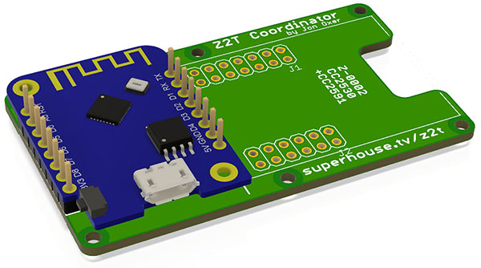

Zigbee2Tasmota Zigbee Coordinator
=================================

Copyright 2019 SuperHouse Automation Pty Ltd  www.superhouse.tv  

Combines a Wemos D1 Mini and a Z-0001 module with CC2531 CC.

Uses the Zigbee2Tasmota firmware to operate as a Zigbee Coordinator.

More information is available at:

  http://www.superhouse.tv/z2t

INSTALLATION
------------
The design is saved as an EAGLE project. EAGLE PCB design software is
available from www.cadsoftusa.com free for non-commercial use. To use
this project download it and place the directory containing these files
into the "eagle" directory on your computer.

DISTRIBUTION
------------
The specific terms of distribution of this project are governed by the
license referenced below.

LICENSE
-------
Licensed under the TAPR Open Hardware License (www.tapr.org/OHL).
The "license" folder within this repository also contains a copy of
this license in plain text format.
